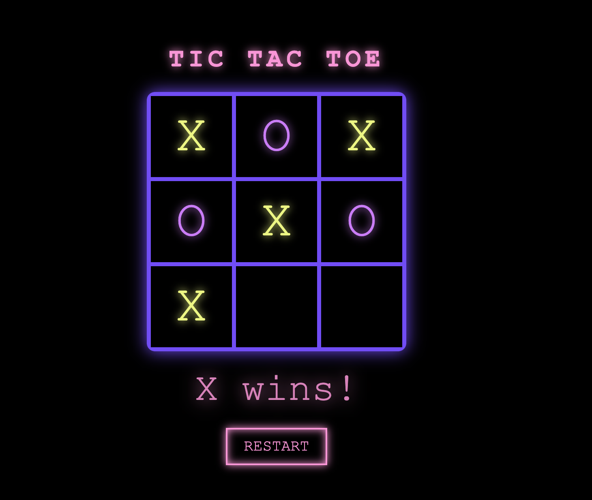

# Tic Tac Toe

[](https://tic-tac-1060912430179.us-central1.run.app)

We are going to create a game of tic-tac-toe playable through two interfaces: the command line and a web application. The project is coded using the Gleam programming language. This is a language I've not used before, so it's going to be a new challenge. 

### Web Interface


### CLI Interface


## Project Structure

The project has three main components: 

### 1. Core
This is the main CLI and includes a tic-tac-toe solver and various types that will be shared. 

### 2. Server
This is the web application backend coded in [Wisp](https://github.com/gleam-wisp/wisp).

### 3. Client
This is a SPA (Single Page Application) coded in Gleam's [Lustre Framework](https://github.com/lustre-labs/lustre). 

We are following the full-stack application building guide found in the Lustre documentation:
https://hexdocs.pm/lustre/guide/06-full-stack-applications.html


## Running Locally

To get started developing the application, you will need to install Gleam. You can find the installation instructions here: [https://gleam.run/install/](https://gleam.run/install/).

Once installed, you can run the application locally using the Gleam CLI.

```
cd server
gleam run 
```

You can also run this via docker

```
docker build -t tic_tac . 
docker run --rm -it -p 8080:8080 tic_tac
```
## Tic Tac Toe Implementation 

I found out that 15 is the magic number for tic-tac-toe. If you number each square magically, then every winning combination adds up to 15. You can iterate on every three-number combination that has been played and check for 15, so let's use that. 

Proposed Phase 1:
Within Core: 
- Create a record type for each square, assigning each square an x, y coordinate where 0,0 is the top-left square.
- Assign each square a "value" where each winning combo of 3 adds to 15. 
- Create a solver function.

Proposed Phase 2:
Within Core:
- Create a CLI interface to the core functions.

In phases 3 and 4, we created and iterated on the web frontend. 

## Deployment 

The project deploys on Google Cloud Run. You can deploy it with the following command:

```bash
gcloud run deploy tic-tac --source .
```

It is currently deployed at [https://tic-tac-1060912430179.us-central1.run.app](https://tic-tac-1060912430179.us-central1.run.app).
